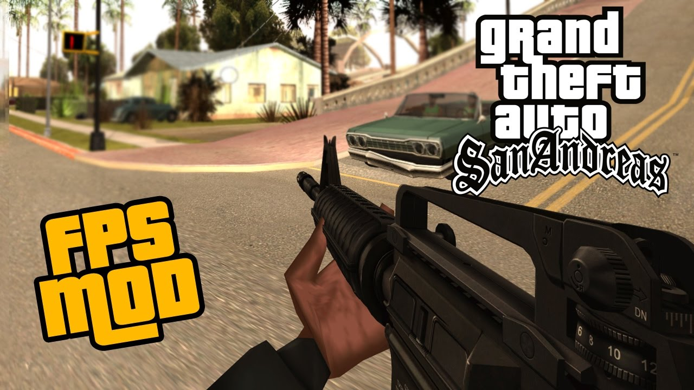

# GTA SAN ANDREAS VR

  

## Hi, human! 🎮

Welcome to the world of Grand Theft Auto: San Andreas in Virtual Reality! This project brings you the thrilling experience of playing as Carl "CJ" Johnson in the immersive VR environment. Utilizing vorpX and Zolika's Trainer Mod, along with a bunch of tweaky tweaks, we've made this dream a reality.

### Why VR?

You might wonder why we bothered to create this VR version when there are official VR implementations of other games out there. Well, we got tired of waiting for Mr. Zucc (Mark Zuckerberg) to bring VR to GTA San Andreas. So, we took matters into our own hands and crafted this unique experience for all you CJ fans.

### How to Get Started?

To play GTA San Andreas in VR, follow these simple steps:

1. **Install vorpX:** First, download and install vorpX, a powerful VR injection tool that enables non-VR games to be played in virtual reality.

2. **Zolika's Trainer Mod:** Grab Zolika's Trainer Mod, which adds various features and functionalities to enhance your VR gameplay.

3. **Tweaky Tweaks:** We've worked on some configurations and tweaks to optimize the VR experience. Check out the included guide on how to apply these tweaks.

4. **Game Setup:** Ensure you have a legitimate copy of GTA San Andreas installed on your PC. Our VR implementation will work seamlessly with the original game.

5. **Launch and Play:** Now, launch vorpX, load up GTA San Andreas, apply the Trainer Mod, and you're ready to embark on your VR journey as CJ!

### Cautionary Notes:

- VR experiences can be intense, so ensure you take regular breaks to avoid fatigue or discomfort.

- Please be aware of your surroundings while immersed in the virtual world to prevent accidents.

- We recommend using a VR-compatible controller or a gamepad for the best gaming experience.

### Contributing:

If you're a passionate GTA modder or have ideas to enhance this VR project, we welcome your contributions! Feel free to fork this repository and submit pull requests.

### Disclaimer:

This project is an unofficial mod, stitched up together by me, a one -man team, and I'm busy with a million other work related projects, so don't expect too much from this mod. Plain old gamepad, you know the drill homeboy ;-) Just enjoy the thrill and be grateful. Namaste. 

Let's hit the streets of Los Santos and have a blast as CJ in Virtual Reality! 🌆🚗💨
